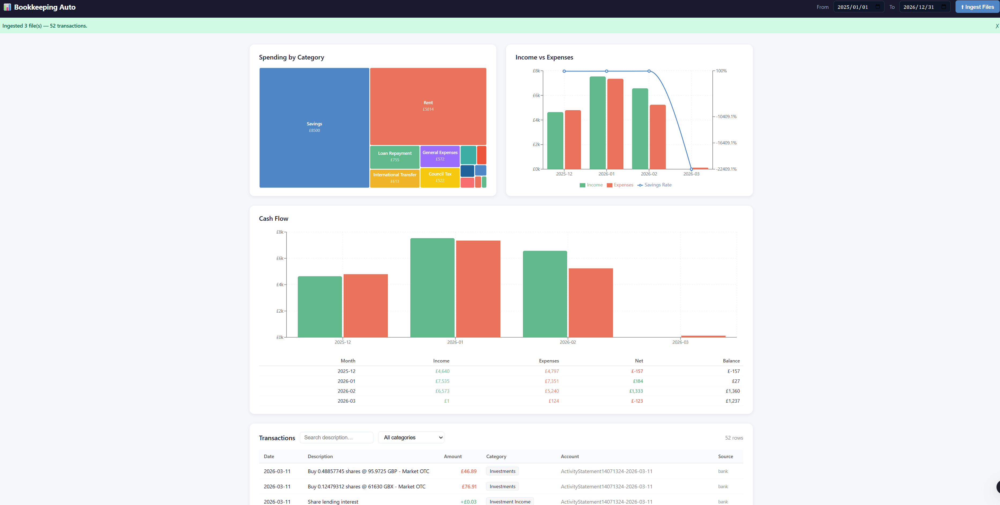

# Bookkeeping Auto

Automatic bookkeeping and personal finance dashboard — ingest bank/credit card/investment statements, let Claude categorise everything, explore the results in a React dashboard.



## Summary

Drop CSV or PDF bank statements into a folder. The tool uses Claude to detect columns, parse transactions, and assign categories. Results appear in a web dashboard with five tiers of analysis: from basic spending breakdowns right through to AI-generated summaries, cash flow projections, and what-if scenario planning.

## How to run

```bash
cp .env.example .env
# Edit .env and add your ANTHROPIC_API_KEY
docker-compose up --build
```

- Dashboard: <http://localhost:3000>
- API docs: <http://localhost:8000/docs>

## Ingest files

1. Copy CSV/PDF bank statements into `data/input/`
2. In the dashboard click **Ingest Files** — or via CLI: `curl -X POST http://localhost:8000/api/ingest`
3. Files are processed only once; re-running skips already-processed files

## Dashboard tiers

### Tier 1 — Overview (the "what happened" layer)

- **Spending breakdown** — treemap by category across the selected date range
- **Income vs Expenses** — monthly bar chart with savings rate line
- **Cash flow waterfall** — starting balance → income → expenses → ending balance per month
- **Transaction table** — searchable, filterable, with inline-editable categories and confidence flags

### Tier 2 — Trends (the "what's changing" layer)

- **Category spend trends** — line chart per category over time; anomaly spikes (1.5σ above rolling average) are highlighted in red
- **Recurring expense detection** — automatically surfaces subscriptions and regular charges with monthly/annual cost and trend direction
- **Spending velocity** — cumulative daily spend within a month overlaid against the prior month, showing when in the month money flows out

### Tier 3 — Investments (the "where am I" layer)

- **Net worth over time** — stacked area chart breaking down running balance by account type (bank, investment, credit card)
- **Current allocation** — live breakdown of latest month's balance across account types

### Tier 4 — Insights (the "so what" layer)

- **AI monthly summary** — Claude generates a plain-English 2-3 sentence summary of any month with key numbers and unusual patterns
- **Anomaly detection** — flags transactions with a z-score > 2 within their category, with severity rating
- **Cash flow projection** — projects income, expenses, and running balance 3/6/12 months forward using recent averages
- **What-if scenarios** — interactive sliders to adjust each spending category up/down and instantly see the impact on monthly savings rate

### Tier 5 — Summary (the UX layer)

- **Annual review** — total income, expenses, savings rate, best/worst months, and a horizontal bar chart of top categories
- **Data quality** — categorisation coverage %, average confidence, uncategorised count, and user-correction count
- **Month-over-month comparison** — pick any two months, see a side-by-side grouped bar chart and table of biggest changes

## Tech stack

- **Backend**: Python 3.12, FastAPI, SQLAlchemy, pdfplumber, pandas
- **Frontend**: React 18, TypeScript, Vite, Recharts, Axios
- **LLM**: Anthropic Claude (`claude-opus-4-6`) via `anthropic` SDK
- **Database**: SQLite at `data/bookkeeping.db`
- **Deployment**: Docker + docker-compose

## Project structure

```text
backend/
  api/          — FastAPI route handlers (analytics, transactions, ingest)
  ingestion/    — file scanner, CSV/PDF parsers, LLM processor
  db/           — SQLAlchemy models and session
frontend/src/
  components/   — all dashboard widgets (one file per chart/view)
  api/client.ts — typed API layer
data/input/     — drop statement files here before ingesting
```
